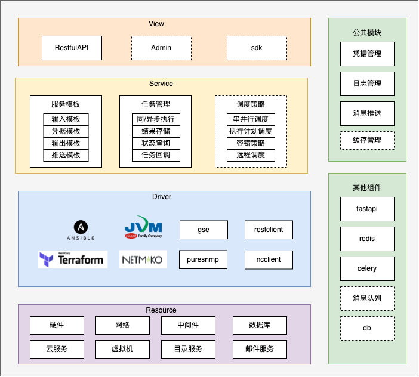

# AutoMate


AutoMate是一个无状态的自动化运维服务，为上层应用提供运维动作的Restful服务.

## 优势
- 无状态
    - 使用restful API方式对接，所有资源均可uri定位，单原子无依赖其他原子能力
- 横向扩展
    - 多种自动化组件驱动能力，如ansible，terrform，netmiko，gse等
- 标准插件能力
    - 可通过标准插件方式实现自动化能力，如ansible模块能力
- 接入点控制
    - 通过管理接入点控制多个automate服务，实现跨云区域能力
- 无agent监控
    - 无需装agent实现监控
- 安全性
    - 凭据管理对接，过程无需关于密码信息传递。开源vault实现
- 社区资源丰富
    - ansible，terrform等丰富社区资源，其社区模块可服务于产品，实现各种自动化能力
- 开源共建
    - 轻量级自动化运维套件：如Ansible的，无代理的自动化运维套件
    - 对接自动化的标准运维原子，如如对数据库、中间件、AD、网络设备等的操作能力插件

## 依赖库文档

* Uvicorn: https://www.uvicorn.org/
* alembic: https://alembic.sqlalchemy.org/en/latest/
* pyarmor: https://pyarmor.readthedocs.io/zh/latest/index.html
* Ansible: https://docs.ansible.com/ansible/latest/collections/index.html
* NetMiko: https://github.com/ktbyers/netmiko
* PureSNMP: https://github.com/exhuma/puresnmp
* NcClient: https://github.com/ncclient/ncclient
* Terraform: https://www.terraform.io/language
* FastAPI: https://fastapi.tiangolo.com/
* Jinja: http://docs.jinkan.org/docs/jinja2/
* LogZero: https://logzero.readthedocs.io/en/latest/
* Python-DotEnv: https://saurabh-kumar.com/python-dotenv/
* Python-Terraform: https://github.com/beelit94/python-terraform
* requests: https://requests.readthedocs.io/en/latest/
* fastapi-utils: https://fastapi-utils.davidmontague.xyz/
* Pydantic: https://pydantic-docs.helpmanual.io/
* ntc-template: https://github.com/networktocode/ntc-templates
* jpype: https://jpype.readthedocs.io/en/latest/
* pycryptodome: https://www.pycryptodome.org/
* ansible-runner: https://ansible-runner.readthedocs.io/en/stable/

## 产品架构


## 开始使用

1. 环境安装

> 可使用pipenv,virtualenv,anaconda,此处仅演示anaconda

```shell
# 创建3.6虚拟环境
conda create --name auto-mate python=3.6
# 进入虚拟环境
conda activate auto-mate
# 安装ansible
pip install ansible -i https://mirrors.aliyun.com/pypi/simple/
# 安装环境所需pip包
pip install -r requirements.txt -i https://mirrors.aliyun.com/pypi/simple/
#安装ansible module相关pip包
pip install -r ansible_plugins/requirements.txt -i https://mirrors.aliyun.com/pypi/simple/
# 安装pre-commit
pip install pre-commit
pre-commit install --allow-missing-config
pre-commit install --hook-type commit-msg --allow-missing-config

```

2.配置开发环境变量
> 开发配置.env文件,环境变量大写且=两侧无空格
> 可配置参数可参考server/core/settings 下Settings

```shell
APP_HOST=127.0.0.1
APP_PORT=8081
ENV=dev
REDIS_URL=redis://localhost?db=0
```

3.启动服务

```shell
# 启动fastapi进程
python main.py
# 启动celery进程
celery -A server.core.celery_app worker -l info
```

4.查看docs
> [AutoMate API Docs](http://127.0.0.1:8081/docs)


## 目录结构
```markdown
├── Dockerfile
├── Makefile
├── Readme.md
├── alembic.ini
├── ansible.cfg
├── ansible_data 
├── ansible_plugins #ansible自定义目录
│   ├── module_utils  #ansible自定义工具类
│   ├── modules  #ansible自定义模块
│   └── requirements.txt  #ansible自定义模块依赖
├── asserts
│   ├── banner.txt  # 系统图标
│   └── playbooks   # ansible playbook目录
├── bin  # 可执行文件目录
│   └── terraform  
├── docs # 文档
│   ├── APIdocs调试.md
│   ├── Ansible脚本开发&调试.md
│   ├── imgs
│   ├── package.json
│   ├── 开发规范.md
├── envs.json #环境变量
├── inventory
├── logs  # 日志目录
├── main.py # 启动文件
├── pyproject.toml
├── requirements.txt  # 项目依赖
├── scripts  # 脚本文件
├── core # 核心模块
├── server # 业务目录
│   ├── __init__.py
│   ├── apps  # 应用目录,其中的每个目录都是一个模板目录
│   │   ├── __init__.py
│   │   ├── ansible
│   │   ├── network
│   │   ├── task
│   ├── libs 
│   ├── utils  # 工具目录
├── setup.py 
├── supervisord.conf
├── template # 模板
│   ├── __init__.py
│   └── blank  # app模板目录(具体层级可参考下面模块分层)
│       ├── __init__.py
│       ├── api 
│       ├── entity 
│       ├── forms 
│       ├── services 
│       ├── tasks 
│       └── url.py
└── tests # 单元测试目录
    ├── __init__.py
    ├── apps  # 应用
    └── driver  #驱动


```

## 开发须知

1. [AutoMate 开发规范](./docs/开发规范.md)
2. [Ansible脚本开发&调试](./docs/Ansible脚本开发&调试.md)
3. [核心模块介绍](./core/Readme.md)
4. [标准运维远程加载插件](./docs/标准运维远程加载插件.md)
5. [标准运维使用Ansible插件](./docs/标准运维使用Ansible插件.md)
5. [云平台CMP插件开发](./cmp_plugins/Readme.md)


