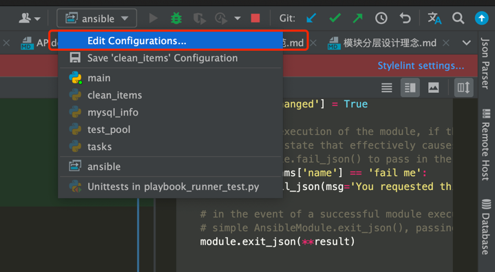
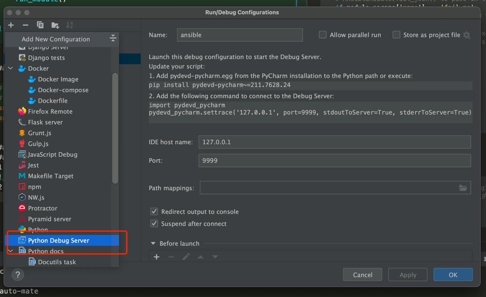
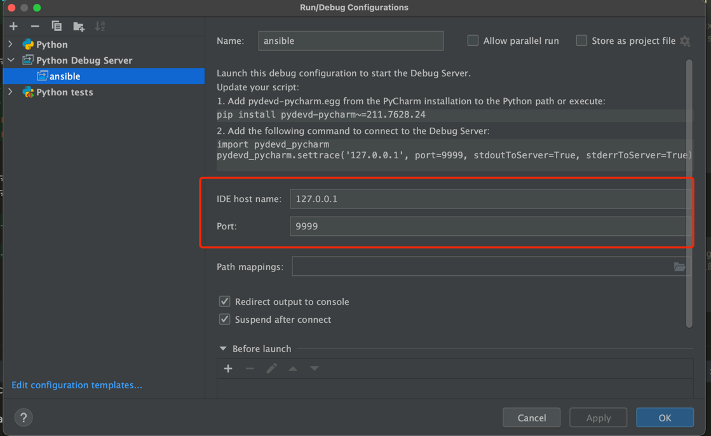
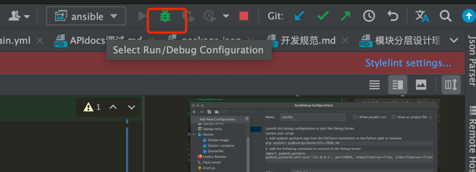
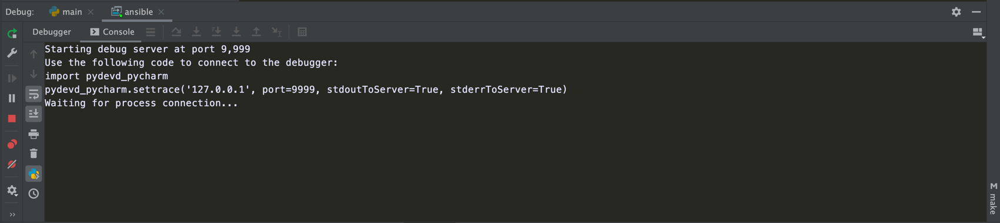
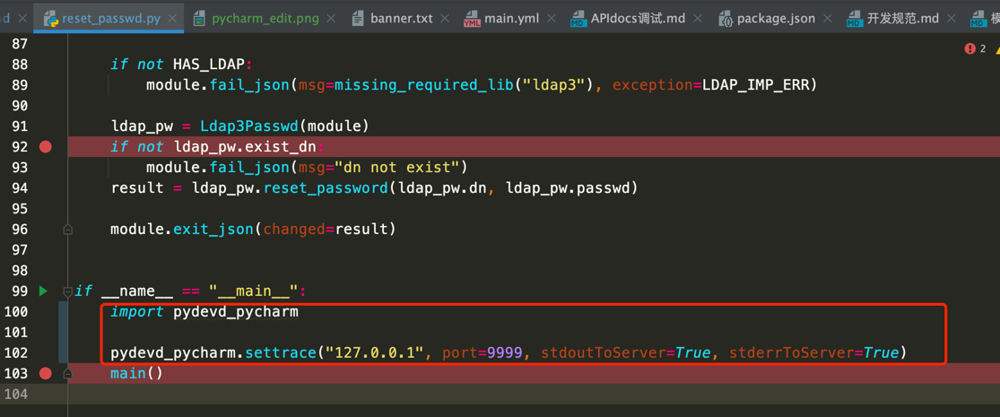

# Ansible模块开发&调试

## 目录管理

> 在项目目录ansible_plugins/modules添加自定义模块,如xx.py.

## 环境变量配置

```shell
export ANSIBLE_LIBRARY=your_project_path/auto-mate/ansible_plugins
export ANSIBLE_MODULE_UTILS=your_project_path/auto-mate/ansible_plugins/module_utils
```

## 创建一个模块模板

> 参考链接: https://docs.ansible.com/ansible/devel/dev_guide/developing_modules_general.html#developing-modules-general

### 模板

```python
#!/usr/bin/python

# Copyright: (c) 2018, Terry Jones <terry.jones@example.org>
# GNU General Public License v3.0+ (see COPYING or https://www.gnu.org/licenses/gpl-3.0.txt)
from __future__ import (absolute_import, division, print_function)

__metaclass__ = type

DOCUMENTATION = r'''
---
module: my_test

short_description: This is my test module

# If this is part of a collection, you need to use semantic versioning,
# i.e. the version is of the form "2.5.0" and not "2.4".
version_added: "1.0.0"

description: This is my longer description explaining my test module.

options:
    name:
        description: This is the message to send to the test module.
        required: true
        type: str
    new:
        description:
            - Control to demo if the result of this module is changed or not.
            - Parameter description can be a list as well.
        required: false
        type: bool
# Specify this value according to your collection
# in format of namespace.collection.doc_fragment_name
extends_documentation_fragment:
    - my_namespace.my_collection.my_doc_fragment_name

author:
    - Your Name (@yourGitHubHandle)
'''

EXAMPLES = r'''
# Pass in a message
- name: Test with a message
  my_namespace.my_collection.my_test:
    name: hello world

# pass in a message and have changed true
- name: Test with a message and changed output
  my_namespace.my_collection.my_test:
    name: hello world
    new: true

# fail the module
- name: Test failure of the module
  my_namespace.my_collection.my_test:
    name: fail me
'''

RETURN = r'''
# These are examples of possible return values, and in general should use other names for return values.
original_message:
    description: The original name param that was passed in.
    type: str
    returned: always
    sample: 'hello world'
message:
    description: The output message that the test module generates.
    type: str
    returned: always
    sample: 'goodbye'
'''

from ansible.module_utils.basic import AnsibleModule


def run_module():
    # define available arguments/parameters a user can pass to the module
    module_args = dict(
        name=dict(type='str', required=True),
        new=dict(type='bool', required=False, default=False)
    )

    # seed the result dict in the object
    # we primarily care about changed and state
    # changed is if this module effectively modified the target
    # state will include any data that you want your module to pass back
    # for consumption, for example, in a subsequent task
    result = dict(
        changed=False,
        original_message='',
        message=''
    )

    # the AnsibleModule object will be our abstraction working with Ansible
    # this includes instantiation, a couple of common attr would be the
    # args/params passed to the execution, as well as if the module
    # supports check mode
    module = AnsibleModule(
        argument_spec=module_args,
        supports_check_mode=True
    )

    # if the user is working with this module in only check mode we do not
    # want to make any changes to the environment, just return the current
    # state with no modifications
    if module.check_mode:
        module.exit_json(**result)

    # manipulate or modify the state as needed (this is going to be the
    # part where your module will do what it needs to do)
    result['original_message'] = module.params['name']
    result['message'] = 'goodbye'

    # use whatever logic you need to determine whether or not this module
    # made any modifications to your target
    if module.params['new']:
        result['changed'] = True

    # during the execution of the module, if there is an exception or a
    # conditional state that effectively causes a failure, run
    # AnsibleModule.fail_json() to pass in the message and the result
    if module.params['name'] == 'fail me':
        module.fail_json(msg='You requested this to fail', **result)

    # in the event of a successful module execution, you will want to
    # simple AnsibleModule.exit_json(), passing the key/value results
    module.exit_json(**result)


def main():
    run_module()


if __name__ == '__main__':
    main()
```

## 执行ansible

```shell
# ansible localhost -m module_name -a "arg1=value1 arg2=value2"
# module_name 模块名可使用ansible内置or自定义的,当前只搜索
ansible localhost -m ping 
ansible l
```

## Pycharm 调试 ansible

### 配置PyCharm远程调试

1. 打开pycharm--》RUN ==》Edit Configuration
   
2. 点击+号按钮，选择Python Remote Debug
   
3. 设置debug的监听地址
   
4. Port 在保证不冲突的情况下可以任意指定
5. 启动pycharm调试
   
   看到console里的监听信息，正在等待远程主机连接。
   

### 安装调试插件

```shell
pip install pydevd-pycharm~=211.7628.24
```

### 在程序入口添加下面两行代码

```python
import pydevd

pydevd.settrace('127.0.0.1', port=9999, stdoutToServer=True, stderrToServer=True)
```



### 执行ansible命令就可以进入调试了

# ModuleUtils开发(模块共用的utils能力)

## 目录管理

> 在项目目录ansible_plugins/modules_utils添加自定义模块,如xx.py.

## 环境变量配置

```shell
export ANSIBLE_MODULE_UTILS=your_project_path/auto-mate/ansible_plugins/module_utils
```

## module_utils编写

> 常规的类设计or函数设计,如class YY() or def yy

## module引用module_utils

```python
from ansible.module_utils.xx import YY
```


## 补充依赖包

> 开发完成后,需要在ansible_plugins目录的requirement.txt文件补充其所需的依赖包 ;格式为 package==version 
> 
> example: PyMySQL==1.0.2
