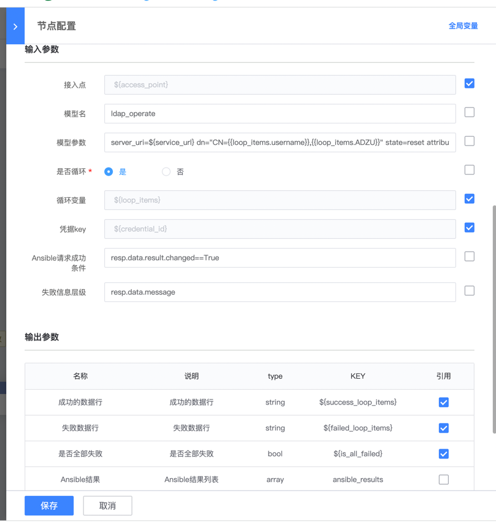

# 标准运维使用Ansible插件
> 目前由于标准运维标准组件没有处理Itsm表格->标准运维的表格方案,同时也不支持循环调用,暂时设计一款兼容企业版ITSM表格传递的自定义执行插件 并支持多行记录的执行
>

### Ansible执行插件(run_ansible)
1. `循环变量`为表格模式,都设置为${loop_items} 例如loop_items = [{"AA":1,""BB":2},{"AA":2,"BB":3}]
2. `是否循环`,如果循环则循环表格变量中的参数,可用{{loop_items.AA}} 循环每一行表格,获取第n行AA列的数据

3. `凭据key`即为vault中的key,如果未使用vault凭据可为空
4. Ansible执行需要`模块名`和`模块参数`,即为Ansible的Adhoc中的-m -a参数
5. `Ansible请求成功条件` 如resp.data.result.changed==True (由resp开头,data即为调用automate后API的响应数据,result为Ansible执行返回数据,changed为Ansible返回标识 )
6. `失败层级数据` 如resp.data.message (由resp开头,data即为调用automate后API的响应数据,message为Ansible调用失败后返回的数据)
7. `成功/失败数据行`,由于支持表格模式,故返回的数据中会标识表格变量中成功和失败的变量
8. `是否全部成功` 即表格变量中是否全部成功,用于区分部分成功,全部失败
9. `Ansible结果` 用于查看表格中每行记录的执行情况,用于分析Ansible具体的执行结果

## 格式化表格(format_table)
> 使用方式如上
## 表格响应(table_resp)

