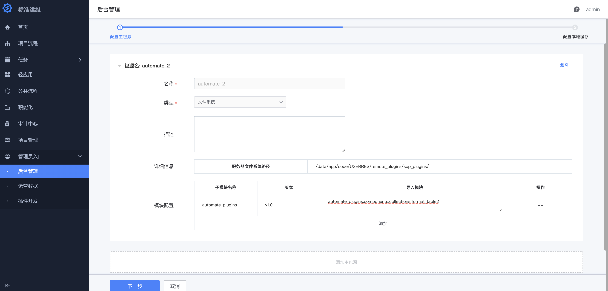
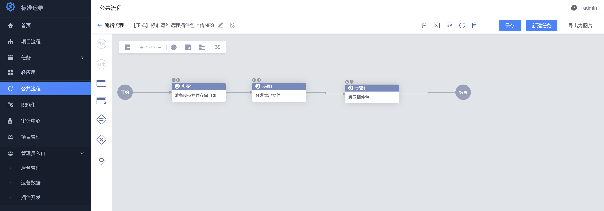
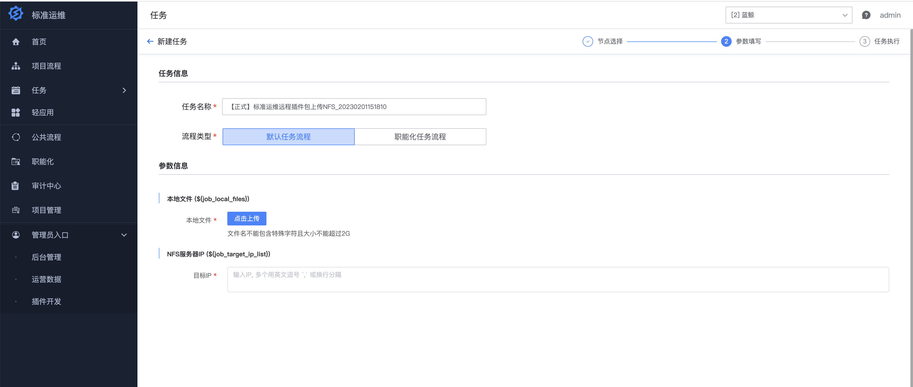
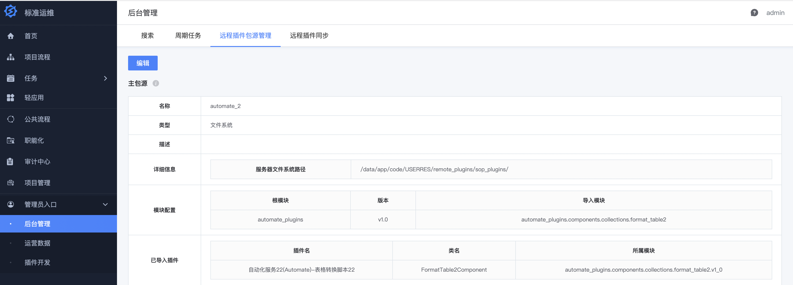
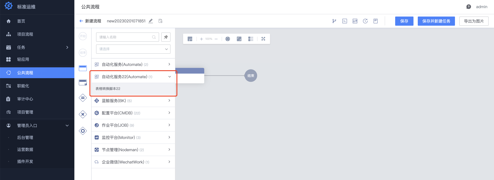

# 标准运维远程加载插件

## 标准插件远程加载原理
> 参考 [原理](https://github.com/Tencent/bk-sops/blob/V3.6.X/docs/features/remote_plugins.md#%E5%AE%9E%E7%8E%B0%E5%8E%9F%E7%90%86) 

## 最佳实践：使用蓝鲸 NFS 方案实现远程加载
> 标准运维插件远程加载支持 Git、S3、文件系统等 3 种文件托管源，其中文件系统的 NFS 方案是蓝鲸默认提供的，不需要额外搭建和维护 GitLab 或 Ceph 等新系统，所以推荐使用 NFS 方案实现插件远程加载。

### 插件改造
> 从远程源加载的插件，对插件如下要求，所以需要对已开发的插件进行 远程加载改造 或者直接按照《【开发指南】嘉为蓝鲸标准运维插件开发指南V1.2》规范进行插件开发。

### 插件表单需要使用嵌入的方式
> 需要声明插件所需的系统中不存在的 python 第三方组件库
### 插件打包
> 直接通过 tar 命令，将开发完成的插件包压缩打包成 tar.gz 格式。
> ```shell
> tar -cvf automate_plugin.tar.gz ./sop_plugins/
> ```

### 插件远程源配置
> 首先，操作人需要有标准运维后台管理权限，一般使用 admin 账户。进入“管理员入口”-“后台管理”页面，点击“远程插件包源管理”选项卡，添加主包源，其中服务器文件系统路径是标准运维运行容器的 NFS 目录 /data/app/code/USERRES/ 的子路径，建议统一设置为 /data/app/code/USERRES/remote_plugins/ 。模块配置稍微复杂点，主要需要注意两个部分，子模块名称是插件包上传解压后的根目录，导入模块是 python import 格式的插件包路径，如 automate_plugins.components.collections.run_ansible ，多个用换行分隔，该文件中定义了插件的 Component 类。插件版本建议每次修改插件后进行改动，如果前端参数能兼容旧版本插件，可以保持版本不变。



### 插件上传和 SaaS 部署
插件包需要上传到 NFS 服务器，可以手动操作，也可以通过标准运维流程自动化。建议下载附件中的“【正式】标准运维远程插件包上传NFS.dat”，导入到部署环境的“蓝鲸”业务（NFS 服务器所在业务）下，然后执行即可，执行时需要在页面上传插件压缩包。



该流程模板主要包含3个任务节点，第一步在 NFS 服务器新建插件存储子模块路径，第二步上传本地文件到 NSF 服务器，第三部解压插件包。


插件完成上传后，进入“开发者中心”，重新部署标准运维 SaaS，插件即可完成远程加载，加载效果可以在“管理员入口”-“后台管理”页面查看，也可以在新建流程业务直接使用新插件。




附件:  [【正式】标准运维远程插件上传NFS.dat](assert/【正式】标准运维远程插件上传NFS.dat)
